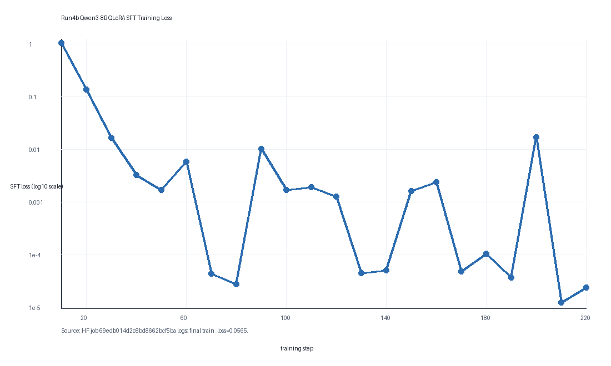
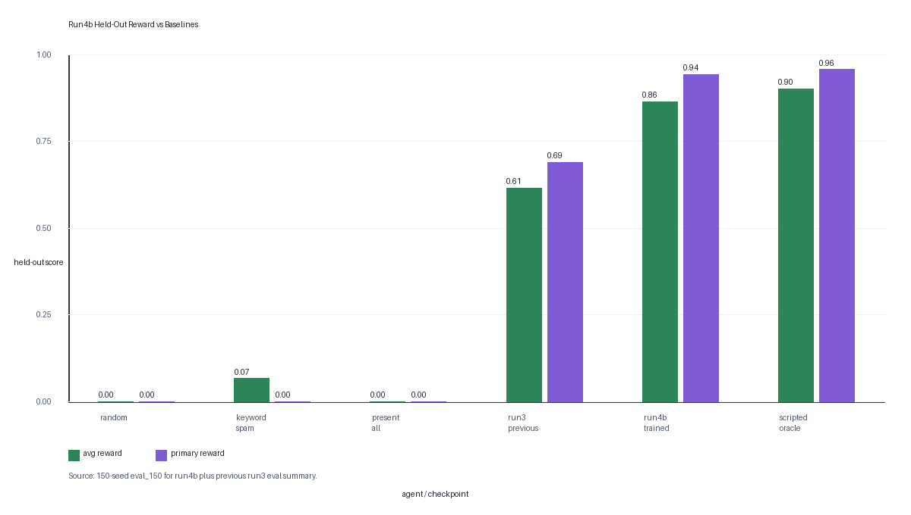

# Counsel-Env: Cross-Examination Arena

Counsel-Env is an OpenEnv courtroom environment where an LLM learns to cross-examine a deterministic witness: make the witness commit to a claim, then present the exhibit that proves the claim false.

We built it around a simple courtroom failure mode: a witness says something that does not match the evidence, but the examiner asks vague questions or shows the evidence too early. Counsel-Env trains the opposite behavior. The agent must ask with intent, track what the witness has committed to, and use the right exhibit at the right moment.

> Baseline behavior: vague questions, early evidence, zero reward.
>
> Target behavior: trigger sealed claim, present matching exhibit, surface contradiction.

## Public Links

- Hugging Face Space: https://huggingface.co/spaces/heavycoderhh/counsel-env
- Live demo: https://heavycoderhh-counsel-env.hf.space/demo
- Official checkpoint: https://huggingface.co/heavycoderhh/counsel-env-qwen3-8b-qlora-sft-run4b
- Original 30-seed eval: https://huggingface.co/heavycoderhh/counsel-env-qwen3-8b-qlora-sft-run4b/tree/main/eval
- Expanded 150-seed eval: https://huggingface.co/heavycoderhh/counsel-env-qwen3-8b-qlora-sft-run4b/tree/main/eval_150
- Blog writeup: [BLOG.md](BLOG.md)

## File Structure

```text
.
|-- README.md                 # single project overview and submission guide
|-- BLOG.md                   # short human-readable project blog
|-- LICENSE                   # BSD-3-Clause license
|-- counsel_env/              # runnable OpenEnv package and HF Space source
|-- assets/                   # plots, eval mirrors, demo material
|-- scripts/                  # validation, eval, and plotting utilities
`-- pytest.ini                # local test config
```

## Try It

Open the live demo:

```text
https://heavycoderhh-counsel-env.hf.space/demo
```

What to try:

1. Reset an easy case.
2. Ask the witness the oracle-hint question.
3. Present the hinted exhibit.
4. Rest the case and watch primary reward appear.

The hint is intentionally exposed for the demo. The training task is to make a model learn that sequence from observations, evidence descriptions, and reward.

## Why This Is Hard

The agent must track another actor's commitments. Presenting evidence too early fails; asking generic questions fails; keyword spam can trigger a claim but does not prove anything. Reward only becomes strong when the agent sequences the cross-examination correctly.

Each episode is a procedurally generated case with:

- a public case brief
- a deterministic witness story
- hidden contradiction objects
- evidence exhibits visible to the agent
- a 15-question budget
- replayable seeds for fair evaluation

A contradiction is surfaced only when both steps happen in order:

1. The agent asks a trigger question and the witness gives a sealed claim.
2. The agent presents the matching disprover exhibit.

The witness is deterministic by design, so reward verification is fast, reproducible, and non-LLM-judged.

## OpenEnv Interface

Counsel-Env uses OpenEnv's standard environment shape:

- `reset`: start a new case
- `step`: execute an action
- `state`: inspect compact environment state

The main environment implementation is here:

```text
counsel_env/server/counsel_env_environment.py
```

The OpenEnv manifest is here:

```text
counsel_env/openenv.yaml
```

Available actions:

| Tool | Field | Purpose |
| --- | --- | --- |
| `ask_question` | `text` | Ask the witness a question. |
| `present_evidence` | `exhibit_id` | Present an exhibit from `available_evidence`. |
| `make_objection` | `reason` | Penalized unless an objection window exists. |
| `rest_case` | none | End the episode and receive final reward. |

## Reward Design

Primary reward is binary per contradiction:

```text
primary_reward = contradictions_surfaced / contradictions_total
```

Auxiliary shaping reduces sparsity while staying secondary:

```text
auxiliary =
  +0.2 * contradictions_triggered
  +0.1 * trigger_keyword_questions
  +0.1 * correctly_timed_evidence
  -0.05 * duplicate_or_irrelevant_questions
  -0.05 * blind_evidence
  -0.1 * inadmissible_actions

total_reward = 0.8 * primary_reward + 0.2 * auxiliary
```

This makes the reward hard to game. Random questions, keyword spam, and blind evidence dumping do not earn primary reward unless a contradiction is actually surfaced.

## Reward-Hacking Audit And Results

The expanded evaluator compares four baselines plus the trained checkpoint across 150 deterministic seeds:

| Agent | Episodes | Avg Reward | Primary Reward | Trigger Rate | Surface Rate |
| --- | ---: | ---: | ---: | ---: | ---: |
| random | 150 | 0.000 | 0.000 | 0.000 | 0.000 |
| keyword_spam | 150 | 0.066 | 0.000 | 0.650 | 0.000 |
| present_all | 150 | 0.000 | 0.000 | 0.000 | 0.000 |
| trained_qwen3_8b_qlora_sft_run4b_eval150 | 150 | 0.864 | 0.943 | 0.943 | 0.943 |
| scripted_oracle | 150 | 0.901 | 0.957 | 0.957 | 0.957 |

Difficulty breakdown for the trained model:

| Slice | Episodes | Avg Reward | Primary/Surface | Invalid Tool Calls |
| --- | ---: | ---: | ---: | ---: |
| easy | 50 | 0.836 | 1.000 | 0 |
| medium | 67 | 0.849 | 0.903 | 0 |
| hard | 33 | 0.939 | 0.939 | 0 |

Run4b is the official submission checkpoint. Run4c was not launched because the expanded eval did not show a hard/medium weakness worth spending more credits on.

## Training Evidence

Run4b was a real 4-bit QLoRA SFT run on `Qwen/Qwen3-8B`, launched as Hugging Face job `69edb014d2c8bd8662bcf5ba`. It trained on 1,460 assistant-only next-action rows generated from the environment curriculum and uploaded the PEFT adapter to:

```text
heavycoderhh/counsel-env-qwen3-8b-qlora-sft-run4b
```

The logged SFT loss dropped quickly during the 220-step run. Final `train_loss` was `0.0565`, with runtime `1287.7s`.



The reward plot compares the trained checkpoint against random, keyword-spam, present-all, the previous run3 checkpoint, and the scripted oracle.



Chart files:

- [assets/training_curves/run4b_training_loss.png](assets/training_curves/run4b_training_loss.png)
- [assets/training_curves/run4b_eval_rewards.png](assets/training_curves/run4b_eval_rewards.png)
- [assets/training_curves/run4b_training_loss.csv](assets/training_curves/run4b_training_loss.csv)
- [assets/training_curves/run4b_eval_rewards.csv](assets/training_curves/run4b_eval_rewards.csv)

## Training Scripts

Run4b training notebook (mirrors the script that produced the official checkpoint):

```text
counsel_env/notebooks/train_counsel_run4b.ipynb
```

Credit-safe GRPO demo notebook:

```text
counsel_env/notebooks/train_counsel.ipynb
```

Fast 8B QLoRA SFT path used for the current best checkpoint:

```bash
COUNSEL_MODEL=Qwen/Qwen3-8B \
COUNSEL_ARTIFACT_REPO=heavycoderhh/counsel-env-qwen3-8b-qlora-sft-run4b \
COUNSEL_SFT_DATASET_SIZE=480 \
COUNSEL_SFT_MAX_STEPS=220 \
COUNSEL_MAX_SFT_LENGTH=1536 \
COUNSEL_SFT_LEARNING_RATE=1e-4 \
COUNSEL_LORA_R=16 \
COUNSEL_LORA_ALPHA=32 \
COUNSEL_GRAD_ACCUM=4 \
COUNSEL_INCLUDE_REST_ROWS=0 \
python counsel_env/scripts/run_qlora_sft_training_job.py
```

TRL GRPO paths are also included:

```text
counsel_env/scripts/run_grpo_training_job.py
counsel_env/scripts/run_sft_grpo_training_job.py
```

The notebook and scripts are credit-safe by default and do not start paid GPU training unless explicitly configured.

## Evidence Artifacts

Submission evidence:

- [BLOG.md](BLOG.md)
- [counsel_env/BENCHMARKS.md](counsel_env/BENCHMARKS.md)
- [assets/demo/video_script.md](assets/demo/video_script.md)

Local trained eval mirrors:

```text
assets/trained_eval_run4b_8b_sft/eval/
assets/trained_eval_run4b_8b_sft_eval150/eval_150/
```

## Run Locally

Install dependencies in your preferred environment, then run:

```bash
uvicorn counsel_env.server.app:app --host 0.0.0.0 --port 8000
```

Client example:

```python
from counsel_env import CounselAction, CounselEnv

with CounselEnv(base_url="http://localhost:8000").sync() as client:
    result = client.reset(curriculum_stage="easy")
    print(result.observation.case_brief)

    result = client.step(CounselAction(tool="ask_question", text="Where were you that night?"))
    print(result.observation.witness_response)
```

## Validation

Full local preflight:

```bash
python scripts/pre_hf_validate.py
```

Fast test suite:

```bash
python -m pytest -p no:cacheprovider -q
```

Latest validation result:

```text
21 passed
PRE-HF PREFLIGHT PASSED
```

## Limitations

- The witness is rule-based so reward stays verifiable and cheap.
- Cases are template-generated rather than open-domain.
- The environment models adversarial questioning mechanics, not full legal procedure.

## Status

Counsel-Env is submission-ready:

- HF Space is public and runnable.
- OpenEnv API is implemented.
- Training scripts and notebook are included.
- Run4b checkpoint is published.
- Training/eval plots are committed.
- Expanded 150-seed eval is published.
- README links the Space, checkpoint, eval, charts, and blog.
