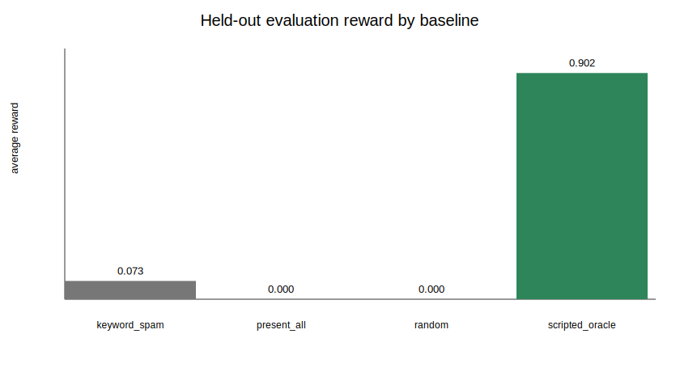
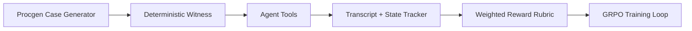
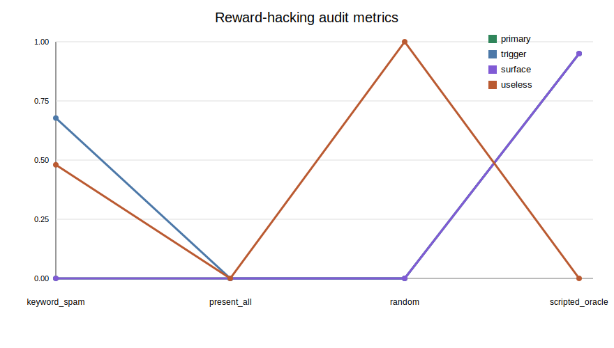

# Cross-Examination Arena

We built a courtroom where an LLM learns to catch lies.

Counsel-Env trains an agent to act like a sharper trial lawyer: make a deterministic witness commit to a claim, then present the exhibit that proves the claim false. It is built for OpenEnv and GRPO-style post-training on multi-agent, partially observable dialogue.

> Baseline behavior: vague questions, early evidence, zero reward.
>
> Target behavior: trigger sealed claim, present matching exhibit, surface contradiction.





## Environment Design

Each episode is a procedurally generated case with:

- a public case brief
- deterministic witness story
- hidden contradiction objects
- evidence exhibits with descriptions visible to the agent
- a 15-question budget
- replayable seeds for before/after evaluation

A contradiction is surfaced only when both steps happen in order:

1. The agent asks a trigger question and the witness gives a sealed claim.
2. The agent presents the matching disprover exhibit.

The witness is deterministic by design. That keeps reward verification fast, cheap, reproducible, and non-LLM-judged.

## Actions

| Tool | Field | Purpose |
| --- | --- | --- |
| `ask_question` | `text` | Ask the witness a question. |
| `present_evidence` | `exhibit_id` | Present an exhibit from `available_evidence`. |
| `make_objection` | `reason` | Currently penalized unless an objection window exists. |
| `rest_case` | none | End the episode and receive final reward. |

## Reward

Primary reward remains binary per contradiction:

```text
primary_reward = contradictions_surfaced / contradictions_total
```

Auxiliary shaping reduces sparsity while staying secondary:

```text
auxiliary =
  +0.2 * contradictions_triggered
  +0.1 * trigger_keyword_questions
  +0.1 * correctly_timed_evidence
  -0.05 * duplicate_or_irrelevant_questions
  -0.05 * blind_evidence
  -0.1 * inadmissible_actions

total_reward = 0.8 * primary_reward + 0.2 * auxiliary
```

Diagnostics log primary, auxiliary, and total reward separately.

## Reward-Hacking Audit

The local evaluator compares four baselines:

| Agent | Avg Reward | Primary Reward | Trigger Rate | Surface Rate |
| --- | ---: | ---: | ---: | ---: |
| random | 0.000 | 0.000 | 0.000 | 0.000 |
| keyword_spam | 0.073 | 0.000 | 0.678 | 0.000 |
| present_all | 0.000 | 0.000 | 0.000 | 0.000 |
| scripted_oracle | 0.902 | 0.950 | 0.950 | 0.950 |

This shows the obvious hacks do not get primary reward: keyword spam can trigger claims, and present-all can burn exhibits, but neither surfaces contradictions.



## Demo Walkthrough

The fastest way to understand the environment is the same-seed demo:

```text
assets/demo/demo_case.md
assets/transcripts/before_after_pairs.md
```

In the demo case, the random baseline presents timestamped surveillance evidence before the witness has committed to a false time, so the witness gives no useful reaction. The successful strategy first asks about time, gets the witness to claim the assault happened at the wrong hour, then presents the timestamped footage.

That sequence is the capability we want training to amplify.

## Curriculum

`generate_case()` supports:

- `difficulty="easy"`: 1 contradiction, obvious trigger language
- `difficulty="medium"`: 2 contradictions, overlapping trigger language
- `difficulty="hard"`: 3+ contradictions, distractor evidence
- `curriculum_stage` and custom sampling distributions

## Local Validation

From the repo root:

```bash
python pre_hf_validate.py
python -m pytest -p no:cacheprovider -q
```

Latest local result:

```text
20 passed
```

The preflight also checks local FastAPI + WebSocket reset/step/state, Docker-style imports, notebook credit guards, rollout diagnostics, and held-out evaluation artifacts.

## Diagnostics

Generate a no-credit local diagnostic sample:

```bash
python -m counsel_env.server.diagnostics
```

Generate held-out baseline artifacts:

```bash
python scripts/run_local_eval.py --episodes 30 --output-dir assets
```

Outputs:

- `assets/heldout_eval.jsonl`
- `assets/heldout_eval_summary.json`
- `assets/plots/baseline_vs_oracle.svg`
- `assets/plots/rubric_breakdown.svg`
- `assets/transcripts/before_after_pairs.md`
- `assets/demo/demo_case.md`
- `assets/demo/video_script.md`
- `assets/demo/blog_draft.md`

## Training

The notebook is at:

```text
counsel_env/notebooks/train_counsel.ipynb
```

It is credit-safe by default:

- `RUN_TRAINING=0`
- `push_to_hub=False`
- `report_to="none"`

GRPO exploration settings:

- `num_generations=6`
- `temperature=0.8`
- `top_p=0.95`
- `max_completion_length=1024`

Tiny approved dry-run mode:

```bash
RUN_TRAINING=1 COUNSEL_MODEL=Qwen/Qwen3-0.6B COUNSEL_MAX_STEPS=5 COUNSEL_DATASET_SIZE=12
```

Before running remote training, approve the spend. Estimated costs:

- A10G dry run: about `$0.50`
- Full A100 GRPO run: about `$6-$10`

## Run Server Locally

```bash
uvicorn counsel_env.server.app:app --host 0.0.0.0 --port 8000
```

Client example:

```python
from counsel_env import CounselAction, CounselEnv

with CounselEnv(base_url="http://localhost:8000").sync() as client:
    result = client.reset(curriculum_stage="easy")
    print(result.observation.case_brief)

    result = client.step(CounselAction(tool="ask_question", text="Where were you that night?"))
    print(result.observation.witness_response)
```

## Limitations

- The witness is rule-based, intentionally, so reward is verifiable and cheap.
- Cases are template-generated rather than open-domain.
- The environment models adversarial questioning mechanics, not full legal procedure.

Future work: self-play witness training, civil deposition templates, jurisdiction-specific admissibility rules, and trained-vs-baseline model ablations after the first GRPO run.

## Status

Local environment validation is complete. Hugging Face Space deployment, real GRPO training, trained-model reward curves, and public video/blog publishing still require approval and compute.
